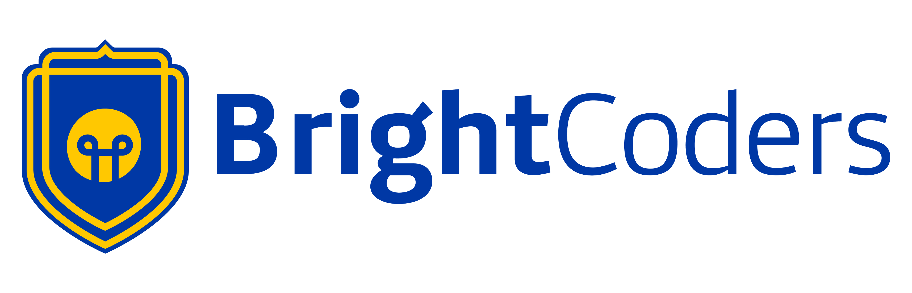

# Diseño web

## Title 
# Proyecto de Diseño Web con SASS y HTML.

## Table of contents.
```
└── 📁s1a1-dise-o-web-responsivo-bcdic23-w1-team3
    └── 📁design
        └── active-states.jpg
        └── desktop-design.jpg
        └── desktop-preview.jpg
        └── mobile-design.jpg
    └── 📁img
        └── bg-hero-desktop.svg
        └── bg-hero-mobile.svg
        └── favicon-32x32.png
        └── icon-email.svg
        └── icon-location.svg
        └── icon-phone.svg
        └── illustration-flowing-conversation.svg
        └── illustration-grow-together.svg
        └── illustration-mockups.svg
        └── illustration-your-users.svg
        └── logo.jpg
        └── logo.png
        └── logo.svg
        └── logofooter.svg
    └── index.css
    └── index.css.map
    └── index.html
    └── index.scss
    └── instructions.md
    └── README.md
    └── style-guide.md
    └── 📁stylesheet
        └── 📁abstracts
            └── mixins.css
            └── mixins.css.map
            └── mixins.scss
        └── 📁components
            └── footer.scss
            └── hero.css
            └── hero.css.map
            └── hero.scss
            └── navbar.css
            └── navbar.css.map
            └── navbar.scss
        └── 📁utils
            └── colors.css
            └── colors.css.map
            └── colors.scss
```
# Description.
En este proyecto, se nos proporcionó una imagen de un diseño de sitio web como guía. Nuestro objetivo era replicar el diseño de la imagen lo más fielmente posible utilizando HTML y SASS.

# How to Install and Run the Project.
In your terminal will run:
```bash
git clone https://github.com/BrightCoders-Institute/s1a1-dise-o-web-responsivo-bcdic23-w1-team3.git
```

To run you must use LiveServer from VScode to see the page

# How to Use the Project.
Open browser
https://deploy-preview-1--design-challenge-team-3.netlify.app
# Credits
This project was developed by [
* Co-authored-by: AlejandroEscobarCampos <ae339640@gmail.com>
* Co-authored-by:etormasa <hector.meza.141@gmail.com>
* Co-authored-by: JosueBlas22 <jjosueblas@gmail.com>
* Co-authored-by: AlejandroJer <ajeronimo@ucol.mx>
* Co-authored-by: angel23v <angelvazquezvirgen@gmail.com>

# Badges


  
